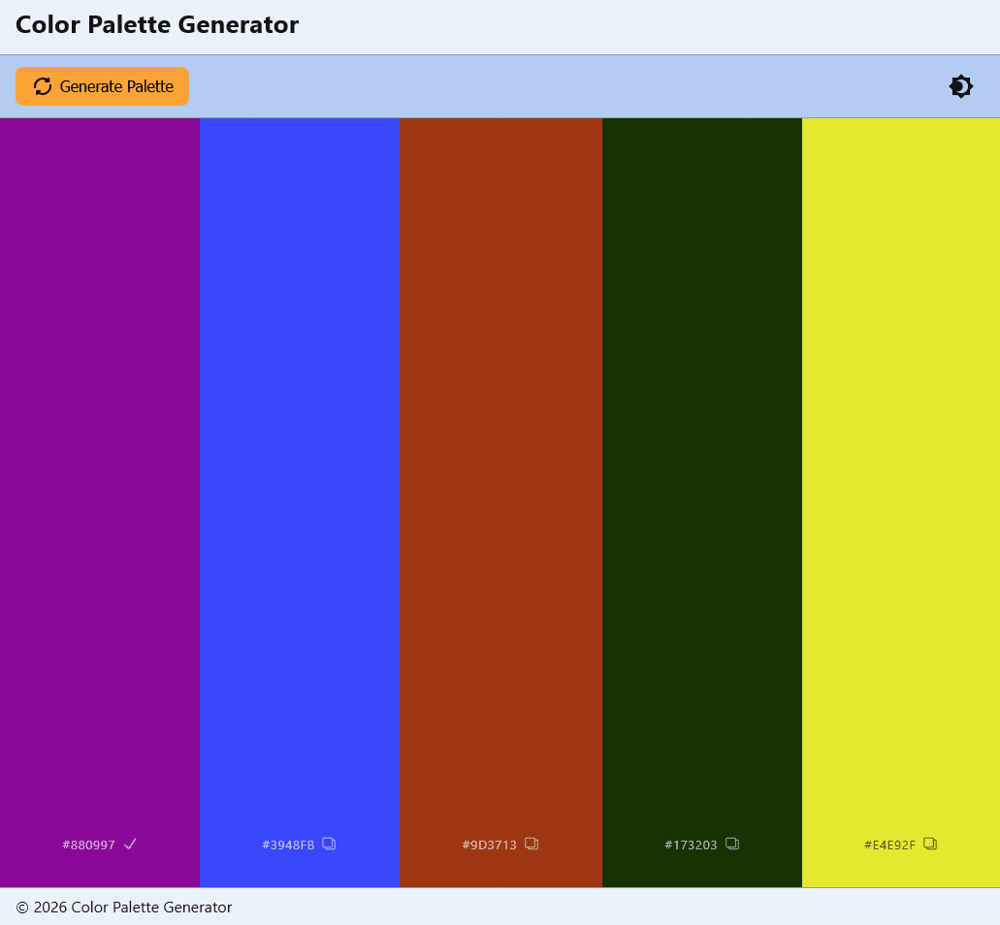
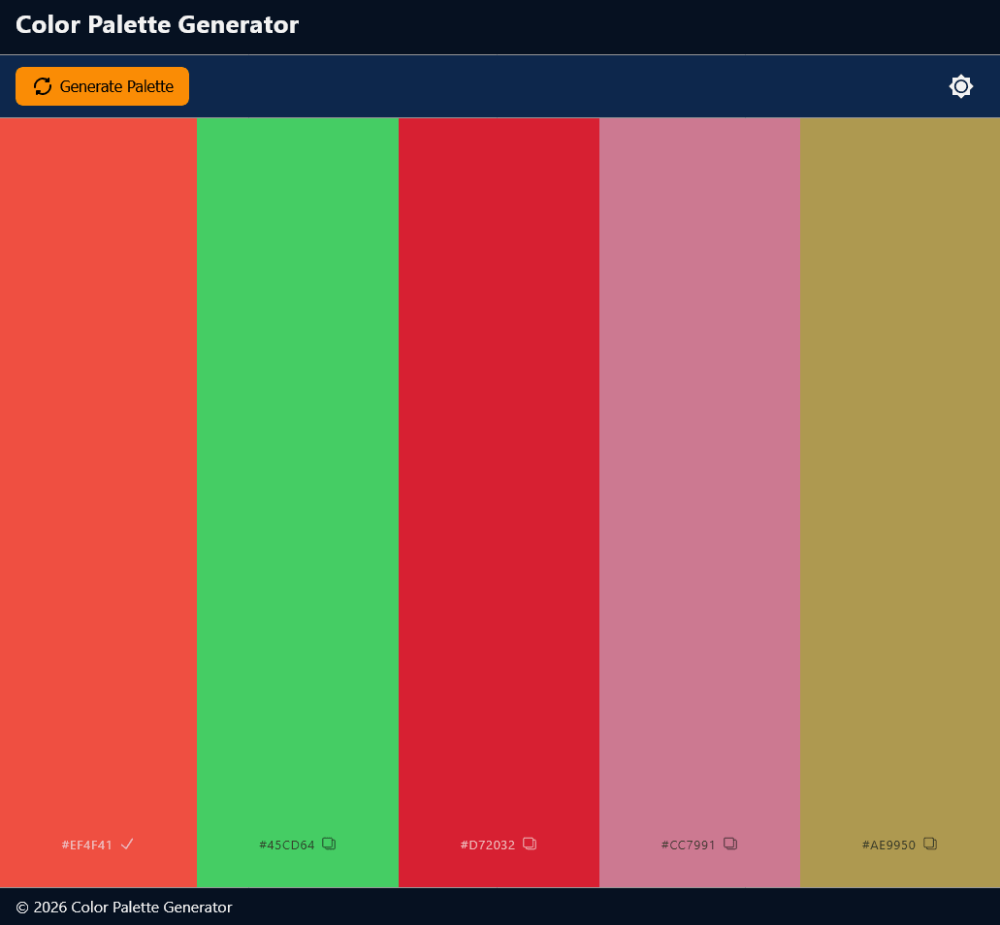
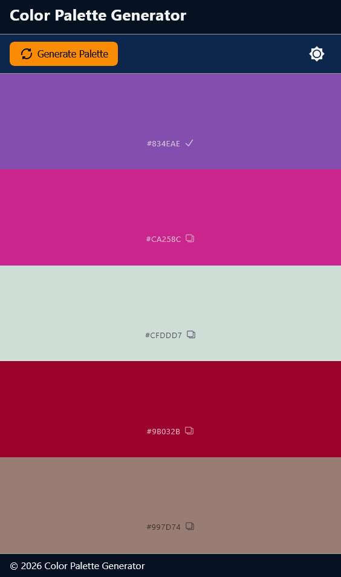

# Color Palette Generator - FCC

This is a random Color Palette Generator project using HTML, CSS, and JS.

# Table of contents

- [Color Palette Generator - FCC](#color-palette-generator---fcc)
    - [Table of contents](#table-of-contents)
    - [Overview](#overview)
        - [The challenge](#the-challenge)
            - [To Do](#to-do)
        - [Screenshot](#screenshot)
    - [My process](#my-process)
        - [Built with](#built-with)
    - [Author](#author)

## Overview

### The challenge

The challenge was to change the original layout from small cards to displaying the colors in a container that spans the majority of the screen. Also, wanted to include a theme switcher from light to dark mode.

#### To Do

- Add closest color name
- Add switch to toggle between HEX, RGB, and HSL values
- More functionality (ie. ability to lock/unlock colors)

### Screenshots

Original Design & Layout

Version 2 Design & Layout

Version 2 Dark Mode

Version 2 Responsive

## My process

### Built with

- Semantic HTML5 markup
- CSS custom properties
- CSS Grid & Flex
- Javascript

## Author

- [@davejnicol](https://github.com/davejnicol)
