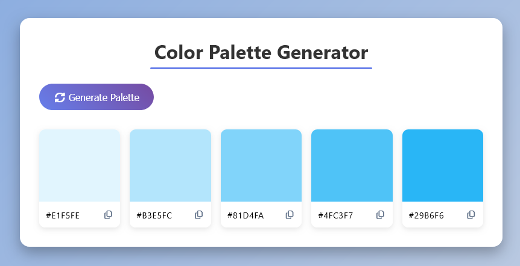

# Color Palette Generator - FCC

This is a random Color Palette Generator project using HTML, CSS, and JS.

# Table of contents

- [Color Palette Generator - FCC](#color-palette-generator---fcc)
    - [Table of contents](#table-of-contents)
    - [Overview](#overview)
        - [The challenge](#the-challenge)
        - [Screenshot](#screenshot)
    - [My process](#my-process)
        - [Built with](#built-with)
    - [Author](#author)

## Overview

### The challenge

### Screenshots

Original Design & Layout

## My process

### Built with

- Semantic HTML5 markup
- Javascript

## Author

- [@davejnicol](https://github.com/davejnicol)
